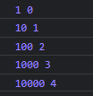

# Array Helper Functions

### forEach

```jsx
//higher order function: forEach
//callback function: myFunction
let myArray = [1,10,100,1000,10000];

myArray.forEach(function (value, index){
    console.log(value,index);
});
```



```jsx

let myArray = [1,10,100,1000,10000];

myArray.forEach(myFunction);

function myFunction (value, index) {
    console.log(value,index);
}
```


---

```jsx
//kendi forEach fonksiyonumuzu yazalım
let myArray = [1,10,100,1000,10000];

function print (value,index){
    console.log(value, index);
}

function myFunction (array, callBack){
    for (let i=0; i < array.length; i++){
        callBack(array[i],i);
    }
}

myFunction(myArray,print);
```


---

### map

```jsx
const myArray = [1,2,3];

/*map, kullanıldığı dizinin  her bir elemanı döndüren 
bir callback fonksiyona sahiptir*/
const newArray = myArray.map(function (value) {
    return value * 2; //return is mandatory
		//value: dizinin mevcut indisindeki değeri temsil eder    
});

console.log(myArray);
console.log(newArray);
console.log(myArray);
```


```jsx
const myArray=[
    { firstName: 'Serkan', age: 23 },
    { firstName: 'Mehmet', age: 21 },
    { firstName: 'Gürkan', age: 22 },
];

const newArray = myArray.map(function (value){
    return value.age;
});
   
console.log(newArray);
```


```jsx
const myArray=[
    { firstName: 'Serkan', age: 23 },
    { firstName: 'Mehmet', age: 21 },
    { firstName: 'Gürkan', age: 22 },
];

const newArray = myArray.map((value) => value.age);
   
console.log(newArray);
```


```jsx
//kendi map fonksiyonumuzu yazalım
const myArray = [1, 2, 3, 4, 5];

console.log(myArray);

function myMap (array, callBack) {
    const tempArray = [];
    for (let i = 0; i < array.length; i++) {
        tempArray.push(callBack(array[i]))     
    }
    return tempArray;
}

const newArray = myMap(myArray, function myCallBack(value){
    return value * 2;
});

console.log(newArray);
```


### filter

```jsx
//without filter 
const myArray = [
    {dataName: "Banana", type: "Fruit"},
    {dataName: "Orange", type: "Fruit"},
    {dataName: "Onion", type: "Vegetable"},
    {dataName: "Watermelon", type: "Fruit"},
    {dataName: "Garlic", type: "Vegetable"},
    {dataName: "Eggplant", type: "Vegetable"},
    {dataName: "Strawberry", type: "Fruit"},
    {dataName: "Leek", type: "Vegetable"},
];

function filterFruits(array){
    const tempArray = [];
    for (let i = 0; i < array.length; i++) {
        if(array[i].type === "Fruit"){
            tempArray.push(array[i].dataName);
        }
    }
    return tempArray;
}

function filterVegetables(array){
    const tempArray = [];
    for (let i = 0; i < array.length; i++) {
        if(array[i].type === "Vegetable"){
            tempArray.push(array[i].dataName);
        }
    }
    return tempArray;
}

console.log(filterFruits(myArray));
console.log(filterVegetables(myArray));
```


```jsx
const myArray = [
    {dataName: "Banana", type: "Fruit"},
    {dataName: "Orange", type: "Fruit"},
    {dataName: "Onion", type: "Vegetable"},
    {dataName: "Watermelon", type: "Fruit"},
    {dataName: "Garlic", type: "Vegetable"},
    {dataName: "Eggplant", type: "Vegetable"},
    {dataName: "Strawberry", type: "Fruit"},
    {dataName: "Leek", type: "Vegetable"},
];

const newArray = myArray.filter(function (array){
    return array.type === "Fruit" //returns true or false
});

console.log(newArray);
```


```jsx
//kendi filter fonksiyonumuzu yazalım
const myArray = [
    {dataName: "Banana", type: "Fruit"},
    {dataName: "Orange", type: "Fruit"},
    {dataName: "Onion", type: "Vegetable"},
    {dataName: "Watermelon", type: "Fruit"},
    {dataName: "Garlic", type: "Vegetable"},
    {dataName: "Eggplant", type: "Vegetable"},
    {dataName: "Strawberry", type: "Fruit"},
    {dataName: "Leek", type: "Vegetable"},
];

function myFilter (array, callBack){
    const tempArray = [];
    for (let i = 0; i < array.length; i++) {
        const result = callBack(array[i]);   
        if(result){
            tempArray.push(array[i]);
        }
    }
    return tempArray;
}

const fruits = myFilter(myArray,function (value) {
    return value.type === "Fruit"; //returns true or false
});

console.log(fruits);
```


### find

```jsx
//without find
const myArray = [
    {id: 8156213541, dataName: "Durdu"},
    {id: 6156213546, dataName: "Emine"},
    {id: 5156213545, dataName: "Hakan"},
    {id: 6156213541, dataName: "Nurcan"},
    {id: 1156213545, dataName: "Ayşegül"},
    {id: 4156913546, dataName: "Serkan"},
];

function findId(array){
    for (let i = 0; i < array.length; i++) {
        if (array[i].id === 4156913546) {
            return array[i];
        }       
    }
}

console.log(findId(myArray));
```


```jsx
const myArray = [
    {id: 8156213541, dataName: "Durdu"},
    {id: 6156213546, dataName: "Emine"},
    {id: 5156213545, dataName: "Hakan"},
    {id: 6156213541, dataName: "Nurcan"},
    {id: 1156213545, dataName: "Ayşegül"},
    {id: 4156913546, dataName: "Serkan"},
];

const result = myArray.find(function (value) {
    return value.id === 4156913546; //returns true or false
});

console.log(result);
```


```jsx
//kendi find fonksiyonumuzu yazalım
const myArray = [
    {id: 8156213541, dataName: "Durdu"},
    {id: 6156213546, dataName: "Emine"},
    {id: 5156213545, dataName: "Hakan"},
    {id: 6156213541, dataName: "Nurcan"},
    {id: 1156213545, dataName: "Ayşegül"},
    {id: 4156913546, dataName: "Serkan"},
];

function myFind (array, callBack){
    let temp = undefined;
    for (let i = 0; i < array.length; i++) {
        if (callBack(array[i])) {
            temp = array[i];
            return temp;
        }
    }
    return temp;
}

const result = myFind(myArray,function (value) {
    return value.id === 4156913546; //returns true or false
});

console.log(result);
```


### every

```jsx
const myArray = [1, 2, 3];

const result = myArray.every(function (value){
    return value < 5;
})

console.log(result);
//true

//Bütün elemanlar 5'den küçük mü onu kontrol etti
```

```jsx
const myArray = [1, 2, 3, 4, 5, 6, 7];

const result = myArray.every(function (value){
    return value < 5;
})

console.log(result);
//false
```

### some

```jsx
const myArray = [1, 2, 3, 4, 5, 6, 7];

const result = myArray.some(function (value){
    return value < 5;
})

console.log(result);
//true

//Şartı sağlayan tek bir eleman olsa dahi true döner
```

# reduce

```jsx
/*
myArray.reduce(function(pre,curr,index){
    
}, initialPreviousValue);
*/
```

```jsx
const myArray = [1, 10, 100, 1000, 10000];

myArray.reduce(function(previousValue, currentValue, currentIndex){
    console.log(previousValue, currentValue, currentIndex);
}, 0);
```


---

```jsx
const myArray = [1, 10, 100, 1000, 10000];

const result = myArray.reduce(function(previousValue,currentValue,currentIndex){
    console.log(previousValue,currentValue,currentIndex);
    return previousValue = previousValue + currentValue;
}, 0);

console.log(result);
```


---

### reduce and map

```jsx
const sayilar = [1, 10, 100, 1000, 10000];

console.log(sayilar);

const yeniDiziWithMap = sayilar.map(function (sayi){
    return sayi * 2 ;
});

console.log(yeniDiziWithMap);

const yeniDiziWithReduce = sayilar.reduce(function (dizininOncekiHali, oankisayi){
    dizininOncekiHali.push(oankisayi*2);
    return dizininOncekiHali;
}, []);

console.log(yeniDiziWithReduce);
```

