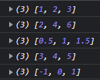

# Higher Order and Callback Functions

```jsx
//without higher order and callback functions
let myArray = [1, 2, 3];

const multiply = function (array) {
    let tempArray = [];
    for (let i = 0; i < array.length; i++) {
        tempArray[i] = array[i] * 2;
    }
     console.log(tempArray);
}

const divide = function (array) {
    let tempArray = [];
    for (let i = 0; i < array.length; i++) {
        tempArray[i] = array[i] / 2;
    }
     console.log(tempArray);
}

const add = function (array) {
    let tempArray = [];
    for (let i = 0; i < array.length; i++) {
        tempArray[i] = array[i] + 2;
    }
    console.log(tempArray);
}

const subtract = function (array) {
    let tempArray = [];
    for (let i = 0; i < array.length; i++) {
        tempArray[i] = array[i] - 2;
    }
    console.log(tempArray);
}

console.log(myArray);

multiply(myArray);
divide(myArray);
add(myArray);
subtract(myArray);
```



```jsx
let myArray = [1, 2, 3];

//first class function
const multiply = function (value) {
    return value * 2;
}
const divide = function (value) {
    return value / 2;
}
const add = function (value) {
    return value + 2;
}
const subtract = function (value) {
    return value - 2;
}

//higher order function 
/* 
parametre olarak fonksiyon alabilen,
return olarak fonksiyon döndüren dödürebilen fonksiyonlardır
*/
const fourOperation = function (array, operation) {
    let tempArray = [];
    for (let i = 0; i < array.length; i++) {
        //tempArray[i] = array[i] * 2;
        tempArray[i] = operation(array[i]);
    }
     console.log(tempArray);
}

console.log(myArray)

fourOperation(myArray, multiply);
fourOperation(myArray, divide);
fourOperation(myArray, add);
fourOperation(myArray, subtract);

//fourOperation fonksiyonu higher order fonksiyondur.
//multiply veya divide fonksiyonları callback fonksiyonlardır.

/*
Callback fonksiyonları, bir başka fonksiyon içerisinde çağırılan ve 
çağrıldığı yere değer döndüren fonksiyonlardır.
*/
```


---

```jsx
//higher order function 
function add (firstValue, secondValue, callBack){
    const temp = firstValue + secondValue;
    callBack(temp);
}

//callback function
function result (value) {
    console.log(value);
}

add(7,3,result);
//10
```

```jsx
function add (firstValue, secondValue, callBack){
    const temp = firstValue + secondValue;
    callBack(temp);
}

add(7,3,function result (value) {
    console.log(value);
});
//10
```

```jsx
function add (firstValue, secondValue, callBack){
    const temp = firstValue + secondValue;
    callBack(temp);
}

add(7,3,function (value) {
    console.log(value);
});
//10
```

---

### forEach

```jsx
//higher order function: forEach
//callback function: myFunction
let myArray = [1,10,100,1000,10000];

myArray.forEach(function (value, index){
    console.log(value,index);
});
```


```jsx

let myArray = [1,10,100,1000,10000];

myArray.forEach(myFunction);

function myFunction (value, index) {
    console.log(value,index);
}
```


---

```jsx
//kendi forEach fonksiyonumuzu yazalım
let myArray = [1,10,100,1000,10000];

function print (value,index){
    console.log(value, index);
}

function myFunction (array, callBack){
    for (let i=0; i < array.length; i++){
        callBack(array[i],i);
    }
}

myFunction(myArray,print);
```


---

### map

```jsx
const myArray = [1,2,3];

/*map, kullanıldığı dizinin  her bir elemanı döndüren 
bir callback fonksiyona sahiptir*/
const newArray = myArray.map(function (value) {
    return value * 2; //return is mandatory
		//value: dizinin mevcut indisindeki değeri temsil eder    
});

console.log(myArray);
console.log(newArray);
console.log(myArray);
```


```jsx
const myArray=[
    { firstName: 'Serkan', age: 23 },
    { firstName: 'Mehmet', age: 21 },
    { firstName: 'Gürkan', age: 22 },
];

const newArray = myArray.map(function (value){
    return value.age;
});
   
console.log(newArray);
```


```jsx
const myArray=[
    { firstName: 'Serkan', age: 23 },
    { firstName: 'Mehmet', age: 21 },
    { firstName: 'Gürkan', age: 22 },
];

const newArray = myArray.map((value) => value.age);
   
console.log(newArray);
```


```jsx
//kendi map fonksiyonumuzu yazalım
const myArray = [1, 2, 3, 4, 5];

console.log(myArray);

function myMap (array, callBack) {
    const tempArray = [];
    for (let i = 0; i < array.length; i++) {
        tempArray.push(callBack(array[i]))     
    }
    return tempArray;
}

const newArray = myMap(myArray, function myCallBack(value){
    return value * 2;
});

console.log(newArray);
```

