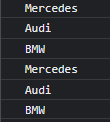

# Others

### Ternary If

```jsx
let a = 10, b = 5, c = 0;

if (a>b){
    c = a + b;
}
else{
    c = a - b;
}
console.log("The value of c is: "+c);
```

```jsx
let a = 10, b = 5, c = 0;

c = (a > b) ? (a + b) : (a - b);
console.log("The value of c is: "+c);
```

---

```jsx
//Sonsuz döngü
for( ; ; ){

}
```

### for

```jsx
let arabaMarkalari = ["Mercedes", "Audi", "BMW"];

for (let i = 0; i < arabaMarkalari.length; i++) {
    console.log(arabaMarkalari[i]);
}

for (let anlıkDiziElemani of arabaMarkalari) {
    console.log(anlıkDiziElemani);
}
```



---

### const

```jsx
/*
Variables defined with const cannot be Redeclared.

Variables defined with const cannot be Reassigned.
*/
const myArray = [1,2,3];

myArray.push(4);
console.log(myArray);

try {
    myArray = [1,11,111];
  }
catch (err) {
    console.log("Error!")
}
```


---

<aside>
📌 Javascript’te fonksiyon dışındaki bir değişkeni fonksiyon içinde kullanabiliriz. Fakat fonksiyon içinde de aynı isimde değişken tanımlarsak artık o sadece fonksiyon içinde yaşar…

</aside>

---

# Local and Session Storage


---

### this


---