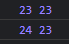

# Referans Tipler Çalışma Mantığı

```jsx
//primitive

let age = 23;
let newAge = age;

console.log(age,newAge);

age = 24;
console.log(age,newAge);
```



---

```jsx
//referans tipli 
//array
let colors = ["Black", "White"];
let newColors = colors;

console.log(colors, newColors);

colors.push("Grey");

console.log(colors, newColors);
```


```jsx
//referans tipli 
//object
let person = {
    studentName: "Serkan",
    age: 23
}

let newPerson = person;

console.log(person, newPerson);

person.age = 24;
console.log(person, newPerson);
```


---

### typeof - instanceof

```jsx
//Object
let person = {
    studentName: "Serkan",
    age: 23
}

console.log(typeof person);
console.log(person instanceof Object);
//object
```

```jsx
//Array, Object
let colors = ["Black","White"]; 

console.log(typeof colors);
console.log(colors instanceof Object);
console.log(colors instanceof Array);
```


```jsx
//Function, Object
const myVariable = function () {
    return 2022-1998; 
}

console.log(typeof myVariable);
console.log(myVariable instanceof Object);
```


---

```jsx
let myArray = [1,2,3];

console.log(myArray);

const myFunction = function (myArray){
    
    for(let i=0; i<myArray.length; i++){
        myArray[i] = myArray[i] * 2 
    }
    return myArray;
}

myFunction(myArray);
console.log(myArray);
```


---